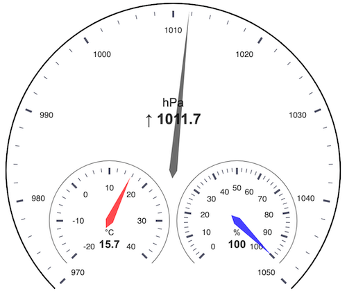

# Tom's Weather Station

Simple weather station on a Raspberry Pi using the BME280 chip for collecting temperatur, humidity and pressure.
The collected data is displayed in charts on a small web page.

### Used Libraries

* [periph.io](https://periph.io/): Peripherals I/O in Go
* [go-sunrise](https://github.com/nathan-osman/go-sunrise): Go package for calculating the sunrise and sunset times for a given location
* [ECharts](https://echarts.apache.org/en/index.html): An Open Source JavaScript Visualization Library
* [Prometheus](github.com/prometheus/client_golang): Prometheus Go client library

### Screenshot

Current values:

Values for one day:

Grafana:

